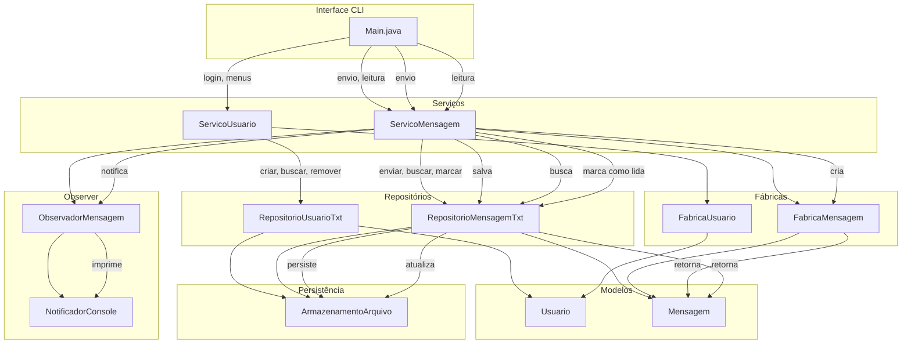

# Fluxograma do Sistema de Notificações (Mermaid)

```mermaid
flowchart TD
    subgraph UI [Interface CLI]
        Main[Main.java]
    end
    subgraph Services [Serviços]
        ServicoUsuario[ServicoUsuario]
        ServicoMensagem[ServicoMensagem]
    end
    subgraph Factories [Fábricas]
        FabricaUsuario[FabricaUsuario]
        FabricaMensagem[FabricaMensagem]
    end
    subgraph Repositories [Repositórios]
        RepUsuario[RepositorioUsuarioTxt]
        RepMensagem[RepositorioMensagemTxt]
    end
    subgraph Models [Modelos]
        Usuario[Usuario]
        Mensagem[Mensagem]
    end
    subgraph Storage [Persistência]
        Armazenamento[ArmazenamentoArquivo]
    end
    subgraph Observer [Observer]
        Observador[ObservadorMensagem]
        Notificador[NotificadorConsole]
    end

    Main -->|login, menus| ServicoUsuario
    Main -->|envio, leitura| ServicoMensagem
    ServicoUsuario -->|criar, buscar, remover| RepUsuario
    ServicoUsuario --> FabricaUsuario
    ServicoMensagem -->|enviar, buscar, marcar| RepMensagem
    ServicoMensagem --> FabricaMensagem
    ServicoMensagem --> Observador
    Observador --> Notificador
    RepUsuario --> Usuario
    RepUsuario --> Armazenamento
    RepMensagem --> Mensagem
    RepMensagem --> Armazenamento
    FabricaUsuario --> Usuario
    FabricaMensagem --> Mensagem

    %% Fluxo de envio de mensagem
    Main -- envio --> ServicoMensagem
    ServicoMensagem -- cria --> FabricaMensagem
    FabricaMensagem -- retorna --> Mensagem
    ServicoMensagem -- salva --> RepMensagem
    RepMensagem -- persiste --> Armazenamento
    ServicoMensagem -- notifica --> Observador
    Observador -- imprime --> Notificador

    %% Fluxo de leitura de mensagem
    Main -- leitura --> ServicoMensagem
    ServicoMensagem -- busca --> RepMensagem
    RepMensagem -- retorna --> Mensagem
    ServicoMensagem -- marca como lida --> RepMensagem
    RepMensagem -- atualiza --> Armazenamento
```

---
